## Code 1
In this I have written a server side code, and a client side code, such that we can create one server, and multiple clients, and all the clients can communicate with each other via the server.

In the attached codes [server1.c](server1.c) and [client1.c](client1.c), I have used **file descriptors**, and select() to listen to various calls made on a port. The select() tells the server whether a disturbance is caused by a new client trying to connect, or whether it is caused by a message sent by an already connected client, or whether some client has left the disconnected the server.
The server must be compiled and executed before running any clients. The compilation and execution can be done by:
```
gcc server1.c -o server
./server
```

This doesn’t require any command line argument. By default, this sets up the port number 11000 as the server port. **Care must be taken to change the IP address of the machine on which the code is being executed manually in both the server and client side code.** After the server is set, the user can create any number of clients. The client execution requires the port number that shall be used, as a command line argument. If the port number used is unavailable, the client binds to a random port number.
```
gcc client1.c -o client
./client 12010                                            //Client with port number 12010
./client 12020                                            //Client with port number 12020
./client 12030                                            //Client with port number 12030
```

After this the user can enter a data in the command line for any client, followed by the port number of another client to which the data must be sent. For example, if the user enters this in the command line of Client 1:
```
Hello Peer client
12020
```

The server shall intercept this message and send it to client with port number 12030. Similarly, at any time a client can join or leave the server. A screenshot of the output is attached below, where client 12010 send a hello message to client 12020, then client 12020 send back a confirmation message to client 12010.

!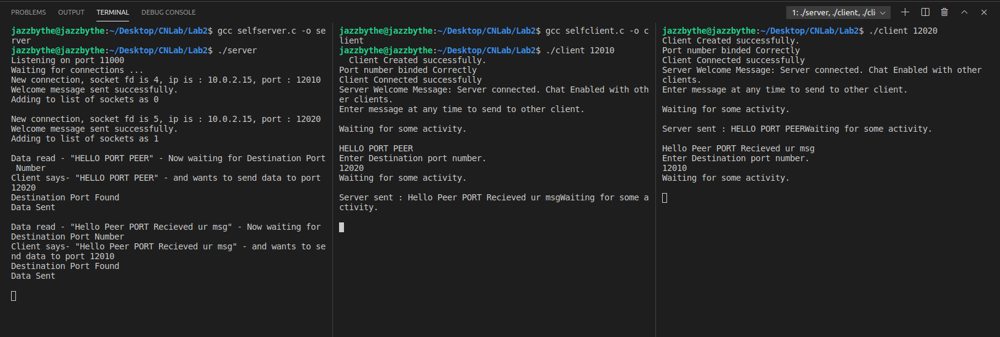


## Code 2

In this I have written a server-side code, and a client side code, such that we can create one server, and multiple clients, and all the clients can communicate with each other via the server, and **also transfer files**.

In the attached codes [server2.c](server2.c) and [client2.c](client2.c), I have used file descriptors, and select() to listen to various calls made on a port. The select() tells the server whether a disturbance is caused by a new client trying to connect, or whether it is caused by a message sent by an already connected client, or whether some client has left the disconnected the server.
The server must be compiled and executed before running any clients. The compilation and execution can be done by:
```
gcc server2.c -o server
./server
```

This doesn’t require any command line argument. By default, this sets up the port number 11000 as the server port. **Care must be taken to change the IP address of the machine on which the code is being executed manually in both the server and client-side code.** After the server is set, the user can create any number of clients. The client execution requires the port number that shall be used, as a command line argument. If the port number used is unavailable, the client binds to a random port number.
```
gcc client2.c -o client
./client 12010                                            //Client with port number 12010
./client 12020                                            //Client with port number 12020
./client 12030                                            //Client with port number 12030
```

After setting up the clients, users can perform 5 operations on each client via the command line input: 
- list: The client can request the list of files from other clients.
- send: The client can request another client to send a file it has.
- message: A client can pass message to another client.
- clear: User can clear the console of a particular client.
- close: User can close a connection between the client and the server.

Here I have attached screenshots of some test cases:

a.	Creating a client with an unavailable port number – Server assigns a random port number to the client and sends a message to the client letting it know its port number.

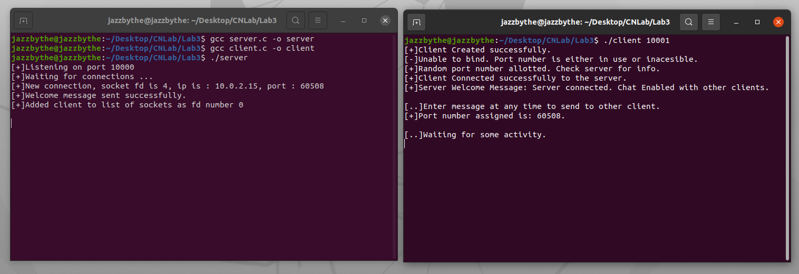

b.	User enters a command different from the 5 commands allowed – Code tells the user to choose from a list of 5 provided commands.

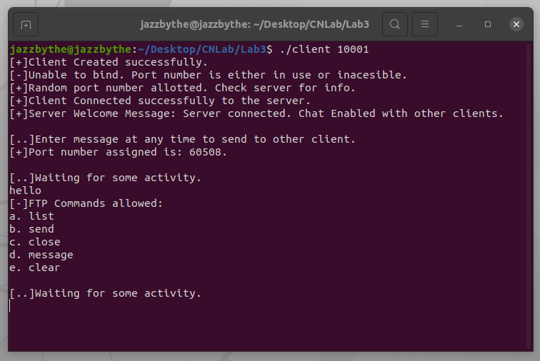

c.	User chooses the clear command – The console of this client is cleared.

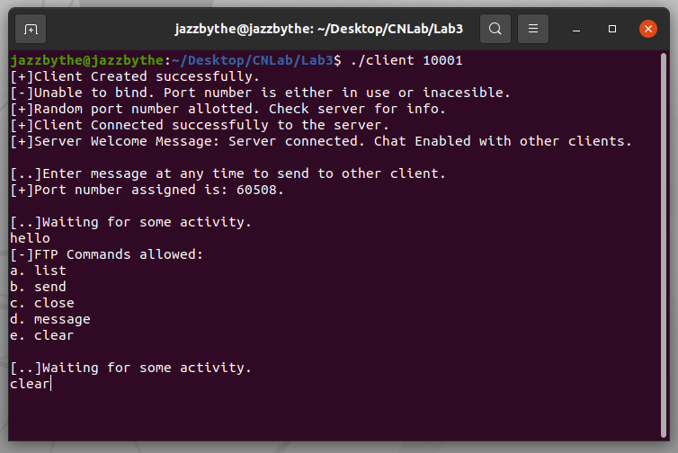
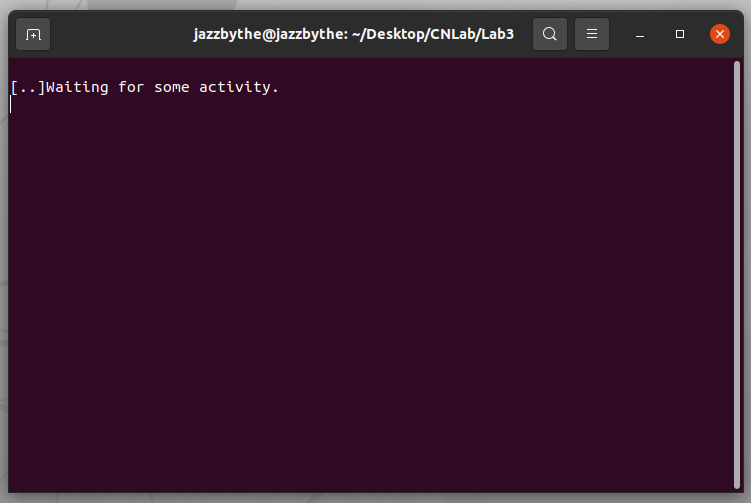

d.	User chooses the close command – The client closes connection with the server.

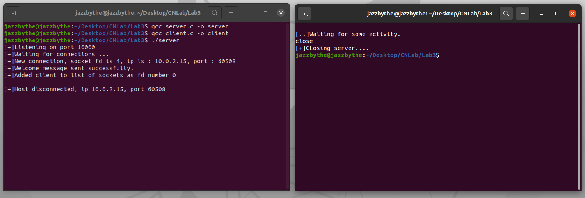

e.	Creating two clients with port numbers 10001 and 10002:

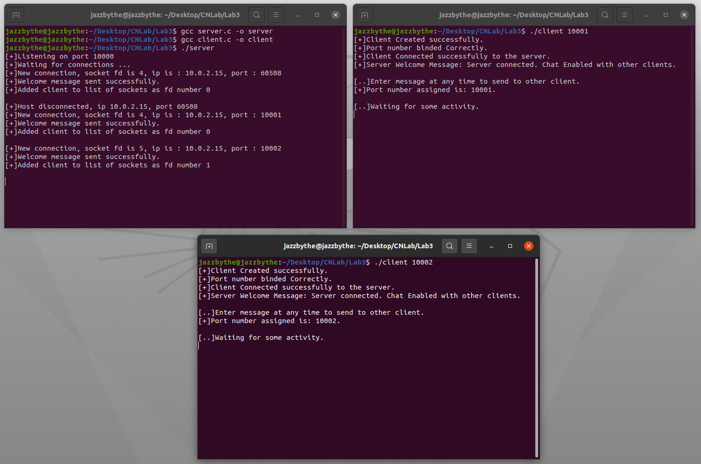

f.	Client 10002 sends message to client 10001:

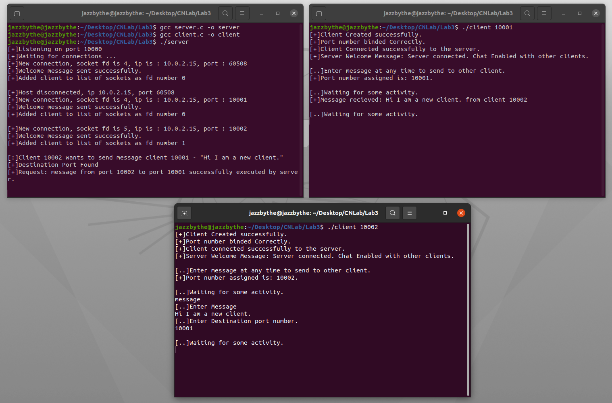

g.	Port 10001 requests client 10002 to send a list of files they have: Client 10002 send an empty list since they don’t have any files currently.

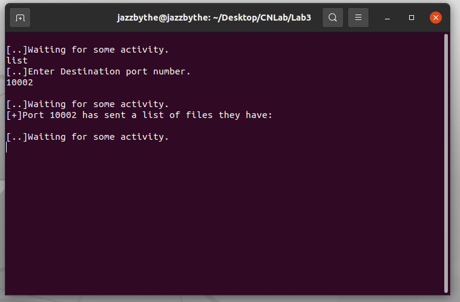

h.	Client 10002 requests Client 10001 to send a list of their files: Client 10001 sends 2 files – tempfile1.txt and tempfile2.tx
The files for each port must be stored in a folder with the same name as the port number, in the same directory. If no such directory exists, the code shall create one, but it would have no files. Thus, for client 10001, it’s files are stored in a folder named 10001, in the same directory as of the code.

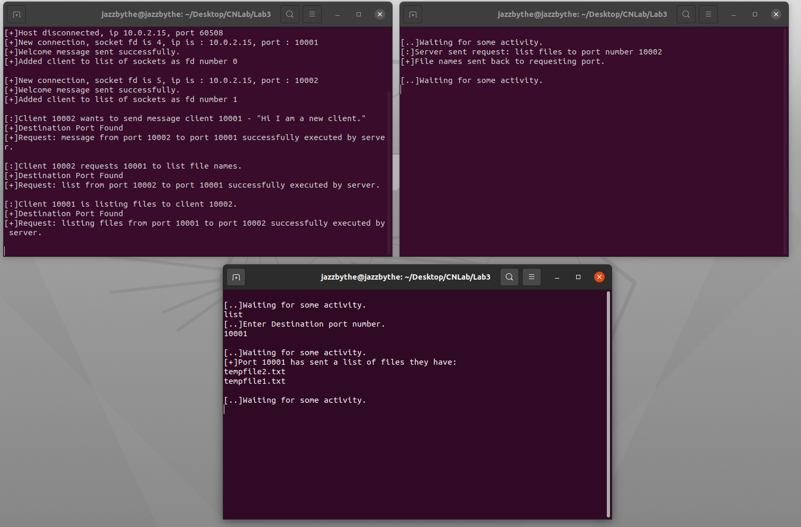

ERROR HANDLING: If during file transfer, any errors occur, appropriate messages are displayed at the client and the server side. Since it’s difficult to manually trigger a read-write error, no screenshots have been attached, however verification for the same can be done by reading the code.

Throughout the command line printing, I have added [+] to denote a successful operation, [-] to denote an error, [..] to denote a client or the server waiting for some input, or some operation to complete, and [:] to print other message, which will make it better to look and easier to spot errors.

i.	Client 10002 requests client 10001 to send filename tempfile1.txt

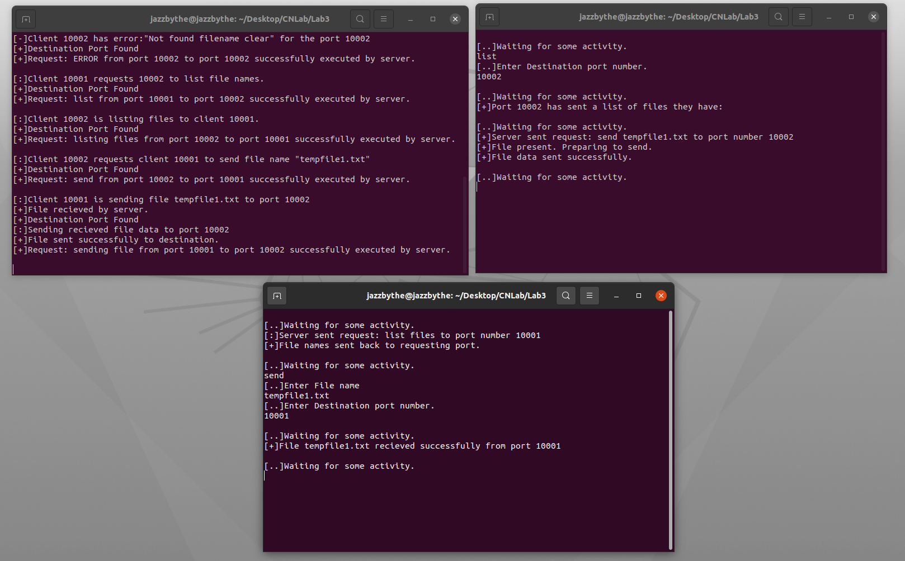

j.	When client 10001 again requests client 10002 to send a list of files they have, we see a file named tempfile1.txt has been added to the list.

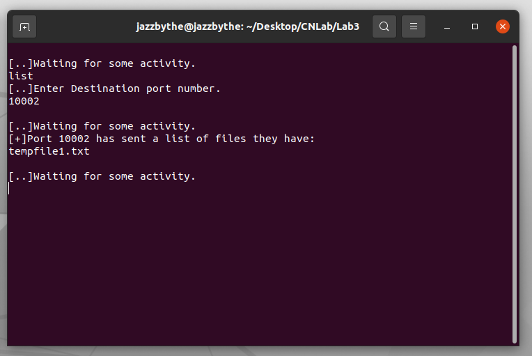

## Code 3

In this I have written a server-side code, and a client side code, such that we can create one server, and multiple clients, and all the clients can subscribe to a list of topics that the server has, and receive updates on the topic.

In the attached codes [server3.c](server3.c) and [client3.c](client3.c), I have used file descriptors, and select() to listen to various calls made on a port. The select() tells the server whether a disturbance is caused by a new client trying to connect, or whether it is caused by a message sent by an already connected client, or whether some client has left the disconnected the server.
The server must be compiled and executed before running any clients. The compilation and execution can be done by:
```
gcc server3.c -o server
./server
```

This doesn’t require any command line argument. By default, this sets up the port number 10000 as the server port. **Care must be taken to change the IP address of the machine on which the code is being executed manually in both the server and client-side code.** After the server is set, the user can create any number of clients. The client execution requires the port number that shall be used, as a command line argument. If the port number used is unavailable, the client binds to a random port number.
```
gcc clientFileName.c -o client
./client 12010                                            //Client with port number 12010
./client 12020                                            //Client with port number 12020
./client 12030                                            //Client with port number 12030
```

After setting up the clients, users can perform 5 operations on each client via the command line input: 
- list: The client can request the list of topics from the server
- subscribe: The client can subscribe to a particular topic that the server has.
- news: A client can pass news update to the server.
- clear: User can clear the console of a particular client.
- close: User can close a connection between the client and the server.

Here I have attached screenshots of some test cases:

a.	Client requests server to send a list of topics available. Currently 4 topics are available.

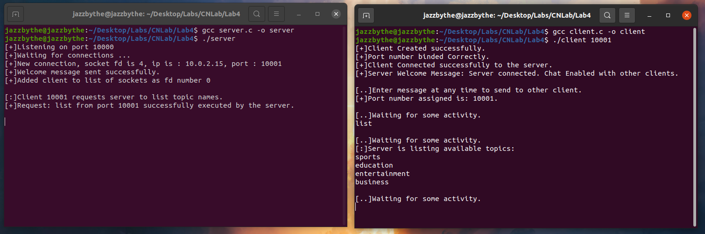

b. User adds a new topic in the server list – Server informs all clients to update their topic list.

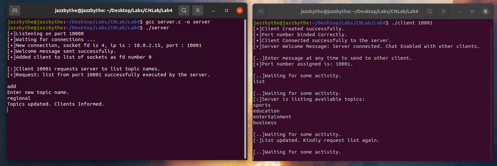

c.	Client again requests the new topic list.

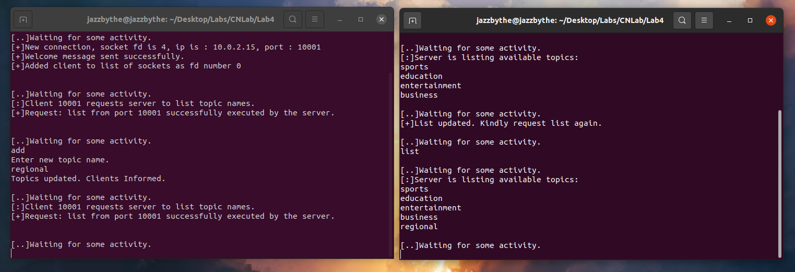

d.	Client subscribes to a topic.

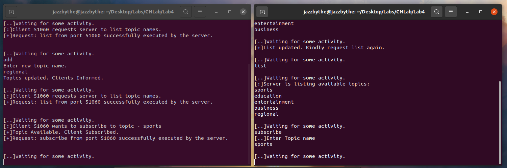

e.	New client sends news for a topic – The news is broadcasted to subscribed clients.

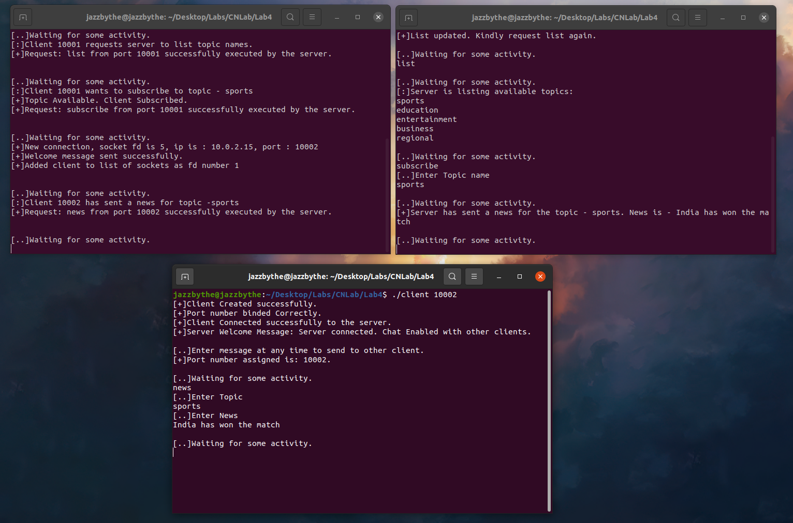
